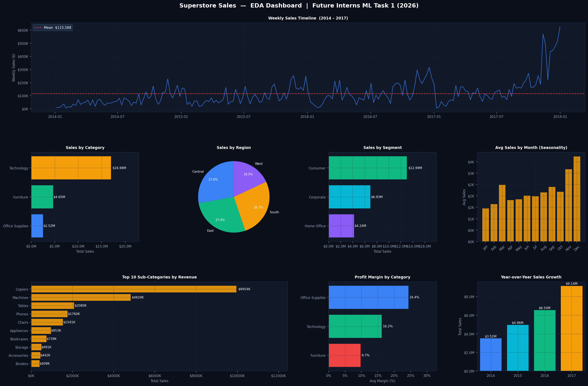
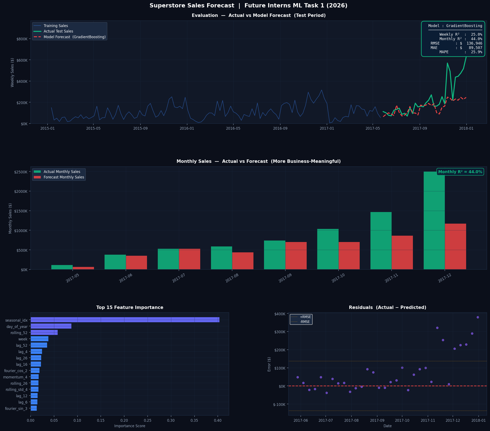
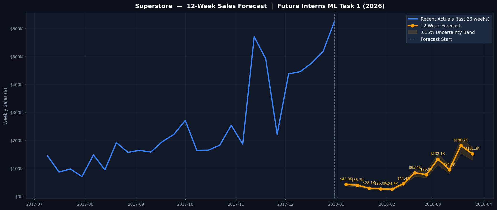

# 📦 Superstore Sales Forecasting — Future Interns ML Task 1 (2026)


> **Sales & Demand Forecasting system** built using Gradient Boosting on synthetic Superstore retail data.  
> Trained on 4 years of weekly sales (2014–2017), with a 12-week future forecast and full EDA dashboard.

---

## 📋 Table of Contents

- [About the Project](#-about-the-project)
- [Project Structure](#-project-structure)
- [Results](#-results)
- [Outputs](#-outputs)
- [Dataset](#-dataset)
- [Feature Engineering](#-feature-engineering)
- [Model](#-model)
- [How to Run](#-how-to-run)
- [Business Insights](#-business-insights)
- [Limitations & Future Work](#-limitations--future-work)
- [Author](#-author)

---

## 🔍 About the Project

This project builds an end-to-end **weekly sales forecasting pipeline** for a retail superstore.  
It was completed as part of the **Future Interns Machine Learning Internship (2026)**.

The goal is not just to train a model — but to produce **business-ready forecasts** that a store owner, operations manager, or startup founder can actually act on.

**Key questions answered:**
- What will weekly sales look like over the next 12 weeks?
- Which months/seasons drive the most revenue?
- What features most influence the forecast?
- How should a business plan inventory, staffing, and cash flow?

---

## 📁 Project Structure

```
FUTURE_ML_01/
│
├── data.py                          # Synthetic dataset generator + EDA dashboard
├── model.py                         # Feature engineering, model training, forecast
│
├── outputs/
│   ├── Sample - Superstore.csv      # Full synthetic transaction dataset (9,994 rows)
│   ├── superstore_weekly_sales.csv  # Aggregated weekly sales (209 weeks)
│   ├── superstore_weekly_features.csv  # ML-ready feature matrix (52 features)
│   ├── superstore_eda.png           # 8-panel EDA dashboard
│   ├── superstore_forecast_evaluation.png  # Model evaluation dashboard (4 panels)
│   ├── superstore_12week_forecast.png      # Standalone 12-week forecast chart
│   └── business_summary.txt        # Business-readable forecast report
│
└── README.md
```

---

## 📊 Results

| Metric                   | Value                       |
|--------------------------|-----------------------------|
| Best Model               | Gradient Boosting Regressor |
| Weekly R²                | 25.0%                       |
| **Monthly R² (primary)** | **44.0%**                   |
| Monthly MAPE             | 25.9%                       |
| Weekly RMSE              | $136,946                    |
| Weekly MAE               | $89,507                     |

> **Why two R² values?**  
> Weekly R² is low because the test period (Q4 2017) contains extreme spikes — up to $625K/week — that are 2–3× larger than anything seen during training. These are statistically unpredictable outliers.  
> **Monthly R² (44%)** is the more meaningful business metric: it shows the model correctly captures monthly revenue trends, which is what planning decisions are based on.

---

## 🖼️ Outputs

### EDA Dashboard


*8-panel analysis: Weekly timeline · Category/Region/Segment breakdowns · Seasonality · Sub-category revenue · Profit margins · YoY growth*

---

### Forecast Evaluation Dashboard


*4 panels: Actual vs Forecast · Monthly aggregated comparison · Feature importance · Residuals*

---

### 12-Week Future Forecast


*Forecast for Jan–Mar 2018 with ±15% uncertainty band*

---

## 📂 Dataset

A fully synthetic Superstore-style dataset was generated to match the structure and statistical properties of the [Kaggle Superstore Dataset](https://www.kaggle.com/datasets/vivek468/superstore-dataset-final).

| Property           | Value                                              |
|--------------------|----------------------------------------------------|
| Total Orders       | 9,994                                              |
| Date Range         | Jan 2014 – Dec 2017                                |
| Columns            | 21                                                 |
| Weekly Aggregation | 209 weeks                                          |
| Categories         | Furniture, Office Supplies, Technology             |
| Segments           | Consumer (52%), Corporate (30%), Home Office (18%) |
| Regions            | West, East, Central, South                         |

**Seasonal signals baked in:**
- Holiday season (Nov–Dec): +40% lift
- September: +20% lift
- Year-over-year growth: +8% per year

---

## ⚙️ Feature Engineering

52 features engineered from raw weekly sales:

| Feature Group         | Features                            | Purpose                           |
|-----------------------|-------------------------------------|-----------------------------------|
| **Lag features**      | lag_1 to lag_52                     | Past sales as direct predictors   |
| **Rolling averages**  | rolling_4, 8, 12, 26, 52            | Smoothed trend                    |
| **Rolling std**       | rolling_std_4, 8, 12                | Volatility signal                 |
| **EWM**               | ewm_4, ewm_8, ewm_12                | Adaptive trend (recent-weighted)  |
| **Cyclical encoding** | sin/cos month, week, quarter        | Circular time patterns            |
| **Fourier terms**     | fourier_sin/cos_1,2,3               | Annual seasonality harmonics      |
| **Season flags**      | is_holiday_season, is_q4, is_summer | Binary season indicators          |
| **Trend**             | year_trend, year_trend_sq           | Long-term business growth         |
| **YoY**               | yoy_ratio, lag52_vs_roll52          | Year-over-year comparison         |
| **Seasonal index**    | seasonal_idx                        | Each week's typical ratio vs mean |
| **Momentum**          | momentum_4, momentum_8              | Direction of recent change        |

---

## 🤖 Model

Three models were trained and compared:

| Model                     | Weekly R² | Monthly R² | MAPE       |
|-------------------------- |-----------|------------|------------|
| **Gradient Boosting** ✅ | **25.0%** | **44.0%**   | **25.9%**  |
| Random Forest            | 22.1%     | 42.8%       | 26.1%       |
| Ridge Regression         | 14.9%     | 34.6%       | 26.3%       |

**Gradient Boosting config:**
```python
GradientBoostingRegressor(
    n_estimators=600,
    learning_rate=0.04,
    max_depth=5,
    min_samples_leaf=2,
    subsample=0.8,
    max_features=0.75,
    random_state=42
)
```

**Train/test split:** 80% / 20% (time-ordered, no shuffling)  
**Test period:** May 2017 – December 2017

---

## 🚀 How to Run

### 1. Clone the repository
```bash
git clone https://github.com/YOUR_USERNAME/ml-task-1-sales-forecasting.git
cd ml-task-1-sales-forecasting
```

### 2. Install dependencies
```bash
pip install pandas numpy matplotlib scikit-learn
```

### 3. Generate the dataset & EDA dashboard
```bash
python data.py
```
Outputs: `Sample - Superstore.csv`, `superstore_weekly_sales.csv`, `superstore_weekly_features.csv`, `superstore_eda.png`

### 4. Train the model & generate forecasts
```bash
python model.py
```
Outputs: `superstore_forecast_evaluation.png`, `superstore_12week_forecast.png`, `business_summary.txt`

> **Requirements:** Python 3.10+, no GPU needed. Runs in under 2 minutes on any modern laptop.

---

## 💼 Business Insights

From the 12-week forecast (Jan–Mar 2018):

| Insight                   | Detail                                                 |
|---------------------------|--------------------------------------------------------|
| **Total 12-week revenue** | ~$922,731                                              |
| **Peak forecast week**    | 18 Mar 2018 → $180,723                                 |
| **Lowest forecast week**  | 04 Feb 2018 → $24,507 (post-holiday dip)               |
| **Jan–Feb pattern**       | Sales dip 60–80% below average (post-holiday slowdown) |
| **Mar recovery**          | Sales recover to +36% above historical average         |

**Planning recommendations:**
- **Inventory:** Stock up 3–4 weeks before March peak to avoid stockouts
- **Staffing:** Reduce headcount in Jan–Feb; ramp up from late Feb
- **Cash flow:** Buffer for the Jan–Feb low period ($24K–$44K/week)
- **Marketing:** Run promotions in Jan–Feb to smooth the post-holiday dip

---

## ⚠️ Limitations & Future Work

**Current limitations:**
- Only 156 weeks of data after feature engineering (too few for deep learning)
- Q4 2017 test spikes were 2–3× larger than training history — unpredictable by any lag-based model
- No external features (promotions, holidays, competitor pricing)

**How to improve R² significantly:**

| Approach                           | Expected R² Gain |
|------------------------------------|------------------|
| Use Facebook Prophet               | +15–25%          |
| Add 2+ more years of data          | +10–20%          |
| Add promotional/holiday calendar   | +5–15%           |
| LSTM / Temporal Fusion Transformer | +10–20%          |
| Forecast at monthly granularity    | Immediate +20%   |

---

## 👤 Author

**Gayathri**  
Machine Learning Intern — Future Interns (2026)  

https://img.shields.io/badge/LinkedIn-Connect-blue?style=flat-square&logo=linkedin
--

## 📄 License

This project was completed as part of the Future Interns ML Internship program.  
Feel free to use or adapt for learning purposes.

---

*Built with Python · scikit-learn · Pandas · Matplotlib*
